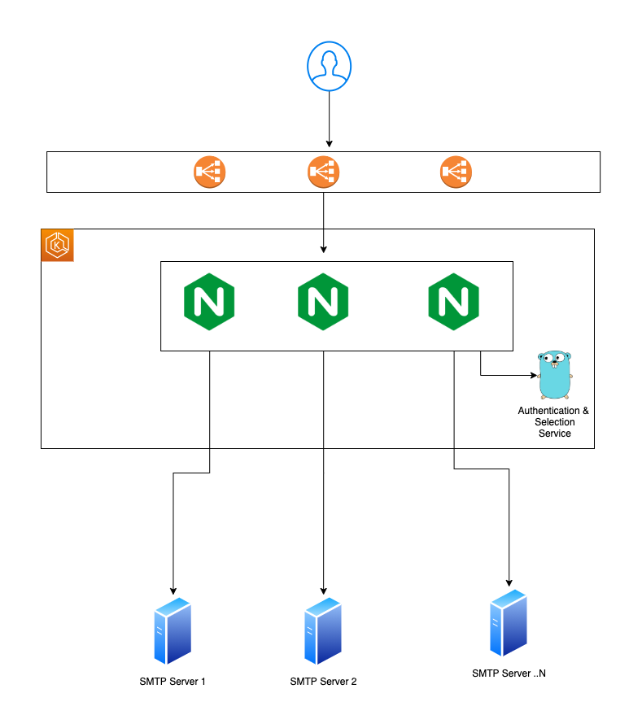

# nginx-smtp

This service serves as the user-facing SMTP server ingress for `mail.lestak.sh`, load balancing requests through a cluster of NGINX servers across the configured upstream SMTP servers.

## Background

Historically, `mail.lestak.sh` was either a single server, or two servers configured with Round-Robin DNS.

Transitioning the SMTP load balancing to NGINX enables a more dynamic configuration, more scalaing potential, and intelligent load balancing based on client IP and the number of connections.

## NGINX Authentication Service

When used as an SMTP proxy, NGINX handles the actual traffic proxying, however it relies on an external service to manage user authentication and selection of the upstream SMTP server.

No authentication is being done by this service - it currently assumes ESMTP will handle that.

However this service is still responsible for the configuration of the upstream SMTP servers, and the selection of the upstream SMTP server for each client request.

Currently this service simply round-robins the upstream SMTP servers, however as the SMTP footprint matures, more intelligent load balancing such as geo-distributed, or client-IP based load balancing can be added.

This service will check the health of the upstream SMTP servers and will remove unhealthy servers from the pool automatically. When a server becomes healthy again, it will be added back to the pool.

## Architecture

